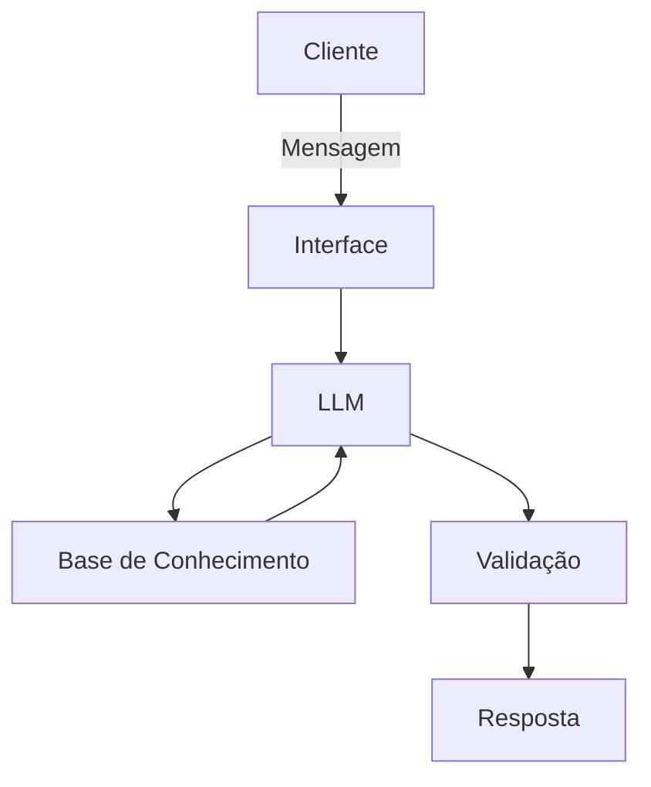

# Documentação do Agente

## Caso de Uso

### Problema
> Qual problema financeiro seu agente resolve?

A lentidão e a subjetividade na análise inicial de solicitações de crédito, que muitas vezes resultam em perda de bons clientes por demora na resposta ou concessão inadequada de risco.

### Solução
> Como o agente resolve esse problema de forma proativa?

O agente realiza uma triagem preditiva imediata. Ele analisa a documentação enviada pelo cliente, cruza com a política interna de crédito da empresa e gera um parecer técnico preliminar em segundos, permitindo que o setor de análise humana foque apenas em casos complexos.

### Público-Alvo
> Quem vai usar esse agente?

Analistas de crédito de instituições financeiras, departamentos de contas a receber e pequenas empresas de crédito.

---

## Persona e Tom de Voz

### Nome do Agente
CreditSense AI

### Personalidade
> Como o agente se comporta? (ex: consultivo, direto, educativo)

Analítico, imparcial e extremamente preciso. O agente adota uma postura de "especialista em compliance" que prioriza a segurança das operações.

### Tom de Comunicação
> Formal, informal, técnico, acessível?

Formal e objetivo. As respostas são estruturadas em tópicos para facilitar a leitura rápida de dados críticos.

### Exemplos de Linguagem
-   Saudação: "Bom dia. Estou pronto para iniciar a análise dos documentos de crédito anexados."

-   Confirmação: "Documentação recebida e validada. Prosseguindo com o cruzamento de dados conforme a política vigente."

-   Erro/Limitação: "A documentação enviada está ilegível ou incompleta. Por favor, forneça o comprovante de rendimentos atualizado para prosseguir."

---

## Arquitetura

### Diagrama

### Componentes

| Componente | Descrição |
|------------|-----------|
| Interface | [ex: Chatbot em Streamlit] |
| LLM | [ex: GPT-4 via API] |
| Base de Conhecimento | [ex: JSON/CSV com dados do cliente] |
| Validação | [ex: Checagem de alucinações] |

---

## Segurança e Anti-Alucinação

### Estratégias Adotadas

- [ ] [RAG Estrito: O agente é instruído a responder "Informação não disponível na política" caso o dado não esteja nos documentos de suporte.]
- [ ] [Toda análise de risco deve citar a cláusula da política que sustenta a decisão.]
- [ ] [O agente nunca aprova o crédito sozinho; ele apenas emite um parecer de "Recomendado" ou "Não Recomendado" para revisão humana.]
- [ ] [Dados sensíveis (CPF, RG) são mascarados antes de serem enviados para o processamento via LLM.]

### Limitações Declaradas
> O que o agente NÃO faz?

-   O agente não possui autoridade para aprovação final de crédito.

-   Não consulta birôs de crédito (Serasa/Boa Vista) em tempo real (apenas analisa os documentos fornecidos).

-   Não emite recomendações baseadas em critérios externos que não estejam na base de conhecimento da empresa.